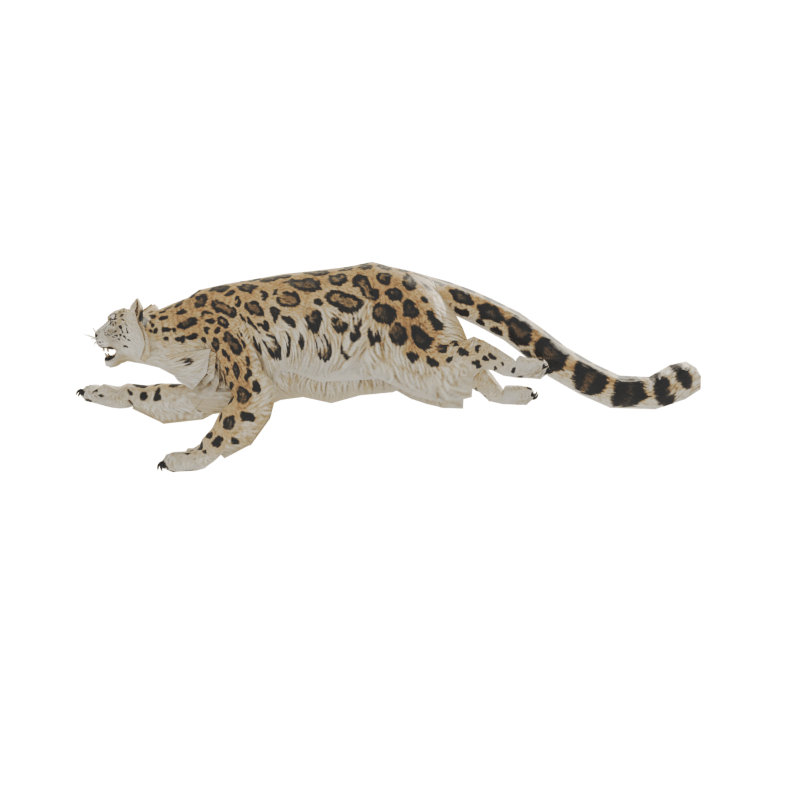
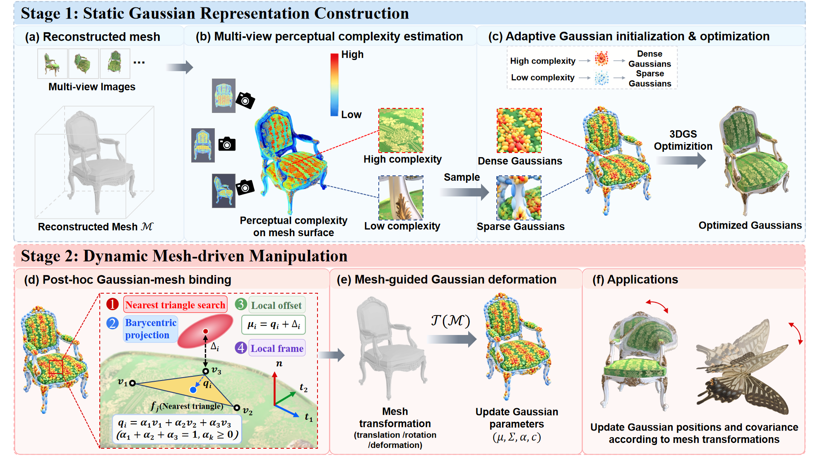
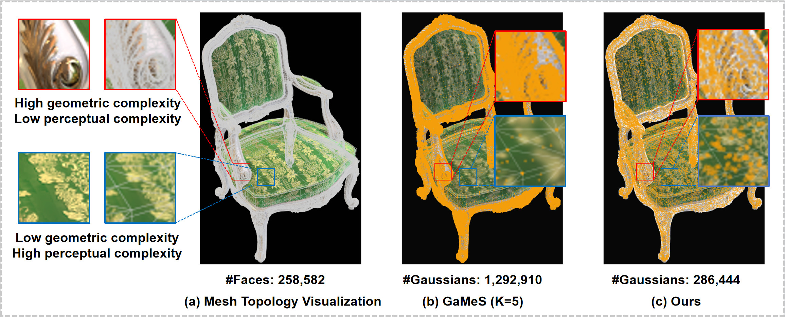
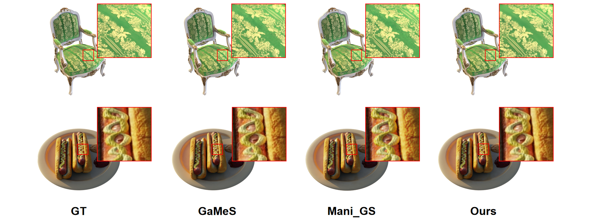
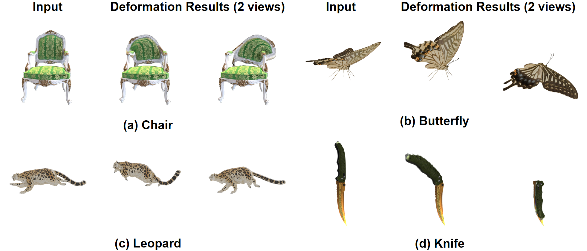

# PIC-MGS: Perception Over Geometry for Mesh Gaussian Splatting

Official implementation of:

**Perception Over Geometry: Rethinking Gaussian Allocation and Optimization in Mesh-based Splatting**

[Paper](#) | [Project Page](#) | [Video](#) 

## Overview

PIC-MGS is a Mesh Gaussian Splatting framework designed for high-fidelity rendering and flexible object manipulation.

While existing Gaussian-based representations achieve impressive rendering quality, enabling editable and geometry-aware representations remains challenging. PIC-MGS explores a new direction for combining Gaussian Splatting with mesh structures, achieving both high-quality novel-view synthesis and mesh-driven object editing.

## Motivation

Existing Mesh Gaussian Splatting methods introduce mesh structures to provide explicit geometric correspondence. However, assigning a fixed number of Gaussian primitives to each mesh face implicitly couples Gaussian allocation with mesh topology.

This assumption can lead to an inconsistency between geometric complexity and appearance complexity. A highly subdivided surface may contain limited visual variation, while a visually complex region may require more representation capacity despite having a simple geometry.

The observation motivates PIC-MGS to rethink Gaussian allocation from a perceptual perspective, where representation capacity should better reflect appearance complexity rather than geometric subdivision alone.

## Highlights

- High-fidelity novel-view synthesis with mesh-aware Gaussian representation.

- Flexible object manipulation with consistent visual appearance.

- Improved representation efficiency compared with existing mesh-based Gaussian methods.

- Supports diverse editing scenarios, including deformation and pose manipulation.

## Results

### Novel View Synthesis

PIC-MGS achieves superior rendering quality on synthetic and real-world benchmarks while maintaining explicit geometric correspondence.

### Mesh-driven Manipulation

PIC-MGS enables flexible object editing while preserving appearance details after geometric modifications.

